# 🏥 PatientTracker - Design Document

<div align="center">


 |
| **📄 Response**      | PDF file as download                         |

> 

**📝 Description:** Downloads the file with the specified ID **only if it was uploaded by the logged-in user**. Unauthorized access to other users' files is not permitted.x-blue.svg)


_A secure, scalable document management system for healthcare professionals_

</div>

---

## 📚 Table of Contents

- [🛠️ Tech Stack Choices](#️-tech-stack-choices)
- [🔄 System Flow](#-system-flow)
- [🌐 API Specification](#-api-specification)
- [📊 Data Flow Description](#-data-flow-description)
- [⚠️ Assumptions](#️-assumptions)

---

## 🛠️ Tech Stack Choices

### ⚛️ Frontend Framework

<table>
<tr>
<td><strong>Framework</strong></td>
<td>React.js</td>
</tr>
<tr>
<td><strong>Version</strong></td>
<td>18.x</td>
</tr>
<tr>
<td><strong>Why Chosen</strong></td>
<td>
• 🚀 Efficient for building interactive, responsive SPAs<br>
• 🌟 Large ecosystem and community support<br>
• 🧩 Component-based architecture promotes reuse<br>
• 🔗 Seamless REST API integration
</td>
</tr>
</table>

### 🌱 Backend Framework

<table>
<tr>
<td><strong>Framework</strong></td>
<td>Spring Boot (Java)</td>
</tr>
<tr>
<td><strong>Version</strong></td>
<td>2.x</td>
</tr>
<tr>
<td><strong>Why Chosen</strong></td>
<td>
• 💪 Robust and scalable REST API development<br>
• 🔒 Mature security, validation, and database integration<br>
• 🏗️ Dependency injection and modularity<br>
• 🏢 Perfect for enterprise applications
</td>
</tr>
</table>

### 🗃️ Database

<table>
<tr>
<td><strong>Database</strong></td>
<td>MySQL</td>
</tr>
<tr>
<td><strong>Version</strong></td>
<td>8.x</td>
</tr>
<tr>
<td><strong>Why Chosen</strong></td>
<td>
• 🔗 Relational model fits user-file relationships<br>
• ⚡ ACID compliance ensures data integrity<br>
• 🤝 Well-supported by Spring Boot<br>
• 📈 Easy to scale and manage
</td>
</tr>
</table>

### 📈 Scaling for 1000+ Users

> **🎯 Performance Optimization Strategies**

<details>
<summary><strong>Click to expand scaling recommendations</strong></summary>

| Strategy                        | Implementation                          | Impact                              |
| ------------------------------- | --------------------------------------- | ----------------------------------- |
| 🔗 **Database Connection Pool** | HikariCP implementation                 | ⚡ Efficient DB access              |
| ☁️ **Cloud File Storage**       | AWS S3 migration                        | 🚀 Better performance & scalability |
| 🗄️ **Caching Layer**            | Redis for frequent queries              | ⚡ Reduced DB load                  |
| ⚖️ **Load Balancing**           | Multiple backend instances              | 📈 Horizontal scaling               |
| 🔍 **Database Optimization**    | Indexing & query optimization           | ⚡ Faster queries                   |
| 🔄 **Async Processing**         | Background file operations              | 🚀 Better user experience           |
| 📊 **Monitoring**               | Application & infrastructure monitoring | 🎯 Proactive issue detection        |

</details>

---

## 🔄 System Flow

### 📋 Flow Description

```mermaid
graph TD
    A[👤 User] --> B[⚛️ Frontend - React]
    B --> C[🌱 Backend - Spring Boot]
    C --> D[🗃️ MySQL Database]
    C --> E[📁 File Storage]

    style A fill:#e1f5fe
    style B fill:#e8f5e8
    style C fill:#fff3e0
    style D fill:#fce4ec
    style E fill:#f3e5f5
```

<div align="center">



</div>

#### 🎯 Component Responsibilities

| Component                    | Responsibilities                                                                                                                                          |
| ---------------------------- | --------------------------------------------------------------------------------------------------------------------------------------------------------- |
| **⚛️ Frontend (React)**      | • 🔐 User authentication & session management<br>• 📤 File upload interface<br>• 📥 File download & management<br>• 📊 Real-time data display             |
| **🌱 Backend (Spring Boot)** | • 🛡️ JWT-based authentication & authorization<br>• 📁 File upload/download processing<br>• 🔍 User-specific data queries<br>• 💾 File metadata management |
| **🗃️ Database (MySQL)**      | • 👥 User account storage<br>• 📋 File metadata & relationships<br>• 🔗 Data integrity maintenance                                                        |
| **📁 File Storage**          | • 📄 PDF document storage<br>• 🗂️ Organized file structure<br>• 💾 Secure file access                                                                     |

### 🔒 Security Flow

```mermaid
graph LR
    A[🌐 Request] --> B{🔍 Route Check}
    B -->|📖 Public /auth/*| C[✅ Allow Access]
    B -->|🔒 Private /api/*| D[🎫 JWT Validation]
    D -->|✅ Valid Token| E[🔐 Authorized Access]
    D -->|❌ Invalid/Expired| F[🚫 401 Unauthorized]
    E --> G{👤 Resource Owner?}
    G -->|✅ Owner| H[📄 Access Granted]
    G -->|❌ Not Owner| I[🚫 403 Forbidden]

    style C fill:#c8e6c9
    style E fill:#c8e6c9
    style H fill:#c8e6c9
    style F fill:#ffcdd2
    style I fill:#ffcdd2
```

<div align="center">



</div>

#### 🛡️ Security Rules

| Route Type            | Authentication            | Authorization         |
| --------------------- | ------------------------- | --------------------- |
| **📖 Public Routes**  | `/auth/*` (login, signup) | ❌ No token required  |
| **🔒 Private Routes** | `/api/*` and others       | ✅ Valid JWT required |

#### 🔐 Token Validation Process

1. **🎫 Token Present?** → If missing: `401 Unauthorized`
2. **⏰ Token Valid?** → If expired/invalid: `401 Unauthorized`
3. **👤 Resource Owner?** → If not owner: `403 Forbidden`
4. **✅ Success** → Access granted

### Simple ASCII Diagram

```
[User]
   |
   v
[Frontend (React)]
   |
   v
[Backend (Spring Boot) + Spring Security] <---> [MySQL Database]
   |
   v
[File Storage (uploads directory)]
```

---

## 🌐 API Specification

<div align="center">


</div>

### 📋 API Overview

| 🔗 Endpoint             | 🎯 Method  | 📝 Description       | 🔒 Auth Required |
| ----------------------- | ---------- | -------------------- | ---------------- |
| `/auth/signup`          | **POST**   | 👤 User registration | ❌ No            |
| `/auth/login`           | **POST**   | 🔐 User login        | ❌ No            |
| `/api/documents/upload` | **POST**   | 📤 Upload a file     | ✅ Yes           |
| `/api/documents/{id}`   | **GET**    | 📥 Download a file   | ✅ Yes           |
| `/api/documents`        | **GET**    | 📋 List user files   | ✅ Yes           |
| `/api/documents/{id}`   | **DELETE** | 🗑️ Delete a file     | ✅ Yes           |

---

### 📤 Upload File

<div align="center">

**`POST http://localhost:8081/api/documents/upload`**

</div>

| Property             | Value                                        |
| -------------------- | -------------------------------------------- |
| **🎯 Method**        | POST                                         |
| **🔒 Auth Required** | ✅ Yes (JWT token in `Authorization` header) |
| **📄 Content-Type**  | `multipart/form-data`                        |
| **📝 Form Field**    | `file` (PDF only)                            |

#### 📊 Sample Response

```json
{
  "fileName": "ospp-chap02-part5.pdf",
  "message": "File uploaded successfully"
}
```

> 

**📝 Description:** Upload a PDF file for the logged-in user; stores file in the server and metadata in the database.

---

### Download File

- **URL:** `GET http://localhost:8081/api/documents/{id}`
- **Method:** GET
- **Auth Required:** Yes (JWT token in `Authorization` header)
- **Sample Response:**
  - Returns the PDF file as a download.


- **Description:**  
  Downloads the file with the specified ID **only if it was uploaded by the logged-in user**.  
  Unauthorized access to other users’ files is not permitted.

---

---

### 📋 List Files

<div align="center">

**`GET http://localhost:8081/api/documents`**

</div>

| Property             | Value                                        |
| -------------------- | -------------------------------------------- |
| **🎯 Method**        | GET                                          |
| **🔒 Auth Required** | ✅ Yes (JWT token in `Authorization` header) |
| **📄 Response**      | JSON array of file metadata                  |

#### 📊 Sample Response

```json
[
  {
    "id": 5,
    "fileName": "Chapter 2 (1).pdf",
    "uploadDate": "2025-08-05T21:19:35.671+00:00",
    "fileSize": 1159689,
    "user": {
      "id": 2,
      "email": "john.doe@example.com",
      "name": "John Doe",
      "password": null,
      "phone": "9876543210",
      "city": "Bangalore",
      "country": "India",
      "state": "Karnataka",
      "pincode": "560001",
      "createdAt": null
    }
  }
]
```

> 

**📝 Description:** Lists all reports uploaded by the currently authenticated user **only**.

---

---

### 🗑️ Delete File

<div align="center">

**`DELETE http://localhost:8081/api/documents/{id}`**

</div>

| Property             | Value                                        |
| -------------------- | -------------------------------------------- |
| **🎯 Method**        | DELETE                                       |
| **🔒 Auth Required** | ✅ Yes (JWT token in `Authorization` header) |
| **📄 Response**      | Success message                              |

#### 📊 Sample Response

```
File deleted successfully
```

> 

**📝 Description:** Deletes the file and its metadata **only if it was uploaded by the logged-in user**. Users cannot delete files uploaded by others.

---

---

### 👤 User Signup

<div align="center">

**`POST http://localhost:8081/auth/signup`**

</div>

| Property             | Value              |
| -------------------- | ------------------ |
| **🎯 Method**        | POST               |
| **🔒 Auth Required** | ❌ No              |
| **📄 Content-Type**  | `application/json` |

#### 📊 Sample Request

```json
{
  "email": "john.doe@example2.com",
  "name": "John Doe",
  "password": "password124",
  "phone": "9876543210",
  "city": "Bangalore",
  "country": "India",
  "state": "Karnataka",
  "pincode": "560001"
}
```

#### 📊 Sample Response

```json
{
  "token": "JWT_TOKEN_HERE",
  "message": "User registered successfully"
}
```

> 

**📝 Description:** Registers a new user and returns a JWT token on success.

---

---

### 🔐 User Login

<div align="center">

**`POST http://localhost:8081/auth/login`**

</div>

| Property             | Value              |
| -------------------- | ------------------ |
| **🎯 Method**        | POST               |
| **🔒 Auth Required** | ❌ No              |
| **📄 Content-Type**  | `application/json` |

#### 📊 Sample Request

```json
{
  "email": "john.doe@example.com",
  "password": "password123"
}
```

#### 📊 Sample Response

```json
{
  "token": "JWT_TOKEN_HERE",
  "message": "User logged in successfully"
}
```

> 

**📝 Description:** Authenticates a user and returns a JWT token for use in further requests.

---

## 📊 Data Flow Description

```mermaid
sequenceDiagram
    participant U as 👤 User
    participant F as ⚛️ Frontend
    participant B as 🌱 Backend
    participant DB as 🗃️ Database
    participant FS as 📁 File Storage

    Note over U,FS: Authentication Flow
    U->>F: 🔐 Login Request
    F->>B: POST /auth/login
    B->>DB: Validate User
    DB-->>B: User Data
    B-->>F: 🎫 JWT Token
    F-->>U: Login Success

    Note over U,FS: File Upload Flow
    U->>F: 📤 Upload File
    F->>B: POST /api/documents/upload + 🎫 JWT
    B->>B: 🔍 Validate Token
    B->>FS: 💾 Store File
    B->>DB: 📋 Save Metadata
    DB-->>B: Success
    B-->>F: Upload Confirmation
    F-->>U: Success Message
```

<div align="center">



</div>

### 🔄 Step-by-Step Process

| Step   | Component       | Action                | Description                                 |
| ------ | --------------- | --------------------- | ------------------------------------------- |
| **1**  | 👤 **User**     | 🔐 Authentication     | User logs in with credentials               |
| **2**  | ⚛️ **Frontend** | 🎫 Token Management   | Receives and stores JWT token               |
| **3**  | 👤 **User**     | 📤 File Upload        | Selects PDF file for upload                 |
| **4**  | ⚛️ **Frontend** | 📡 API Request        | Sends multipart/form-data with JWT          |
| **5**  | 🌱 **Backend**  | 🔒 Token Validation   | Verifies JWT authenticity & expiry          |
| **6**  | 🌱 **Backend**  | 💾 File Processing    | Saves file to uploads directory             |
| **7**  | 🌱 **Backend**  | 📋 Metadata Storage   | Records file info + user ID in MySQL        |
| **8**  | 👤 **User**     | 📋 File Listing       | Views personal files only                   |
| **9**  | 🌱 **Backend**  | 🔍 Ownership Check    | Ensures user can only access own files      |
| **10** | 👤 **User**     | 📥/🗑️ File Operations | Download/delete with ownership verification |

### 🛡️ Security Checkpoints

- **🎫 JWT Validation:** Every private route validates token authenticity
- **⏰ Token Expiry:** Expired tokens return `401 Unauthorized`
- **👤 Ownership Verification:** Users can only access their own files
- **🚫 Access Control:** Non-owners receive `403 Forbidden`

---

## ⚠️ Assumptions

### 🔐 Authentication & Authorization

<table>
<tr>
<td><strong>🎯 Requirement</strong></td>
<td><strong>📝 Details</strong></td>
</tr>
<tr>
<td><strong>🔒 User Authentication</strong></td>
<td>Only logged-in users can upload, list, download, or delete documents</td>
</tr>
<tr>
<td><strong>👤 Resource Ownership</strong></td>
<td>Users can only access files they uploaded</td>
</tr>
<tr>
<td><strong>🎫 JWT Security</strong></td>
<td>All private routes require valid, non-expired JWT tokens</td>
</tr>
</table>

### 🧪 Development Setup

| Component            | Configuration                                               |
| -------------------- | ----------------------------------------------------------- |
| **👥 Guest Account** | `guest@gmail.com` / `guest@1234` (pre-created in MySQL)     |
| **📁 File Storage**  | Local `uploads` directory (migrate to cloud for production) |
| **🗃️ Database**      | MySQL with required tables pre-configured                   |

### 📋 File Management Rules

<div align="center">

| Rule                 | Value                | Icon |
| -------------------- | -------------------- | ---- |
| **File Size Limit**  | 10MB max             | 📏   |
| **Supported Types**  | PDF only             | 📄   |
| **Access Control**   | Owner-only           | 🔒   |
| **Storage Location** | Local uploads folder | 📁   |

</div>

### 🚨 Error Handling

| Scenario                  | HTTP Status             | Response                     |
| ------------------------- | ----------------------- | ---------------------------- |
| **Invalid/Expired JWT**   | `401 Unauthorized`      | Authentication error message |
| **Non-owner file access** | `403 Forbidden`         | Access denied error          |
| **File not found**        | `404 Not Found`         | Resource not found error     |
| **Invalid file type**     | `400 Bad Request`       | File type validation error   |
| **File size exceeded**    | `413 Payload Too Large` | Size limit error             |

### 🎯 Production Considerations

> **💡 Recommendations for scaling beyond development:**

- **☁️ Cloud Storage:** Migrate from local uploads to AWS S3/Azure Blob
- **🗄️ Database:** Implement connection pooling and read replicas
- **📊 Monitoring:** Add comprehensive logging and metrics
- **🔐 Security:** Implement rate limiting and additional security headers
- **🚀 Performance:** Add CDN for file delivery and caching strategies

---

<div align="center">

**🏥 PatientTracker** - _Secure Document Management for Healthcare_


</div>
