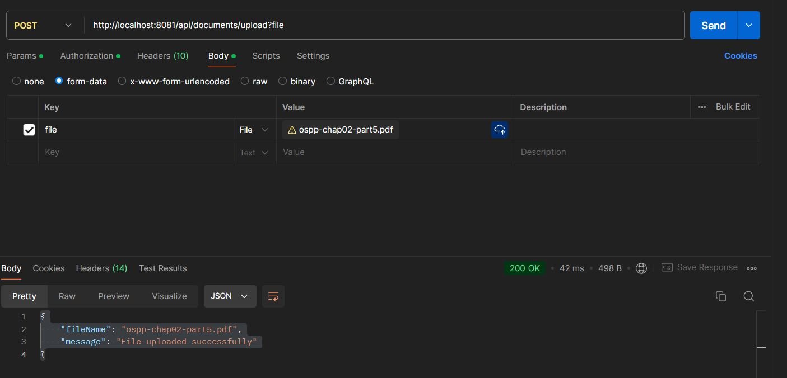
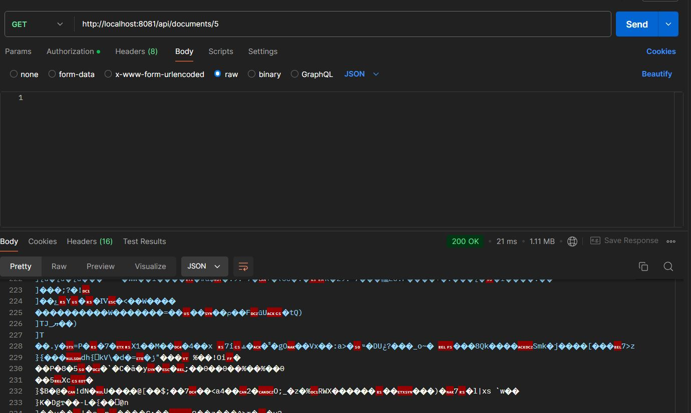
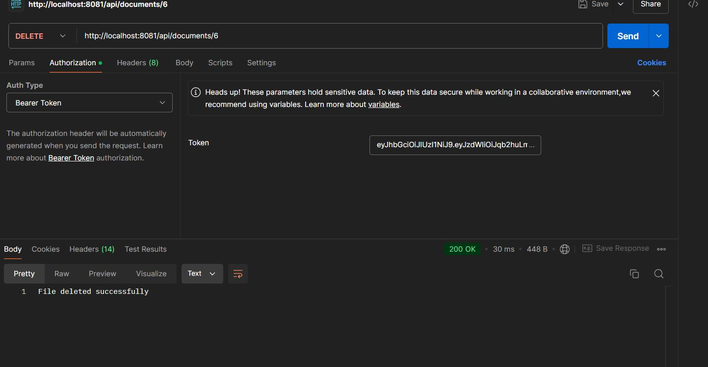

# 🏥 PatientTracker

A secure document management system for healthcare professionals built with React, Spring Boot, and MySQL.

## 📋 Project Overview

• **🔒 Secure Authentication**: JWT-based user login and registration
• **📤 File Upload**: Upload PDF documents securely
• **📥 File Download**: Download your uploaded files
• **📋 Document Management**: View, delete your documents
• **👥 User Isolation**: Each user can only access their own files
• **🛡️ Security**: Spring Security with JWT tokens
• **⚛️ Frontend**: React with responsive design
• **🌱 Backend**: Spring Boot REST API
• **🗃️ Database**: MySQL for data storage
• **📱 Mobile Friendly**: Works on all devices
• **🚀 RESTful APIs**: Clean API endpoints
• **📄 PDF Support**: PDF file handling
• **⚡ Fast Performance**: Optimized file operations
• **🔄 Real-time**: Dynamic file listing
• **📊 Error Handling**: Comprehensive error messages

---

## 🚀 How to Run Locally

### 1️⃣ Clone Repository

```bash
git clone https://github.com/rock-02/patientTracker.git
cd patientTracker
```

### 2️⃣ Frontend Setup

```bash
cd frontend
npm install
npm run dev
```

**Frontend runs on: http://localhost:5173**

### 3️⃣ Backend Setup

1. **Open MySQL Workbench**
2. **Create Schema:**
   ```sql
   CREATE SCHEMA patienttrackerdb;
   ```
3. **Run Backend:**
   ```bash
   cd backend
   ./mvnw spring-boot:run
   ```
   **Backend runs on: http://localhost:8081**

---

## 🌐 Example APIs

| Property             | Value                                        |
| -------------------- | -------------------------------------------- |
| **🎯 Method**        | POST                                         |
| **🔒 Auth Required** | ✅ Yes (JWT token in `Authorization` header) |
| **📄 Content-Type**  | `multipart/form-data`                        |
| **📝 Form Field**    | `file` (PDF only)                            |

#### 📊 Sample Response

```json
{
  "fileName": "ospp-chap02-part5.pdf",
  "message": "File uploaded successfully"
}
```

> 

**📝 Description:** Upload a PDF file for the logged-in user; stores file in the server and metadata in the database.

---

### Download File

- **URL:** `GET http://localhost:8081/api/documents/{id}`
- **Method:** GET
- **Auth Required:** Yes (JWT token in `Authorization` header)
- **Sample Response:**
  - Returns the PDF file as a download.



- **Description:**  
  Downloads the file with the specified ID **only if it was uploaded by the logged-in user**.  
  Unauthorized access to other users’ files is not permitted.

---

---

### 📋 List Files

<div align="center">

**`GET http://localhost:8081/api/documents`**

</div>

| Property             | Value                                        |
| -------------------- | -------------------------------------------- |
| **🎯 Method**        | GET                                          |
| **🔒 Auth Required** | ✅ Yes (JWT token in `Authorization` header) |
| **📄 Response**      | JSON array of file metadata                  |

#### 📊 Sample Response

```json
[
  {
    "id": 5,
    "fileName": "Chapter 2 (1).pdf",
    "uploadDate": "2025-08-05T21:19:35.671+00:00",
    "fileSize": 1159689,
    "user": {
      "id": 2,
      "email": "john.doe@example.com",
      "name": "John Doe",
      "password": null,
      "phone": "9876543210",
      "city": "Bangalore",
      "country": "India",
      "state": "Karnataka",
      "pincode": "560001",
      "createdAt": null
    }
  }
]
```

> 

**📝 Description:** Lists all reports uploaded by the currently authenticated user **only**.

---

---

### 🗑️ Delete File

<div align="center">

**`DELETE http://localhost:8081/api/documents/{id}`**

</div>

| Property             | Value                                        |
| -------------------- | -------------------------------------------- |
| **🎯 Method**        | DELETE                                       |
| **🔒 Auth Required** | ✅ Yes (JWT token in `Authorization` header) |
| **📄 Response**      | Success message                              |

#### 📊 Sample Response

```
File deleted successfully
```

> 

**📝 Description:** Deletes the file and its metadata **only if it was uploaded by the logged-in user**. Users cannot delete files uploaded by others.

---

---

### 👤 User Signup

<div align="center">

**`POST http://localhost:8081/auth/signup`**

</div>

| Property             | Value              |
| -------------------- | ------------------ |
| **🎯 Method**        | POST               |
| **🔒 Auth Required** | ❌ No              |
| **📄 Content-Type**  | `application/json` |

#### 📊 Sample Request

```json
{
  "email": "john.doe@example2.com",
  "name": "John Doe",
  "password": "password124",
  "phone": "9876543210",
  "city": "Bangalore",
  "country": "India",
  "state": "Karnataka",
  "pincode": "560001"
}
```

#### 📊 Sample Response

```json
{
  "token": "JWT_TOKEN_HERE",
  "message": "User registered successfully"
}
```

> 

**📝 Description:** Registers a new user and returns a JWT token on success.

---

---

### 🔐 User Login

<div align="center">

**`POST http://localhost:8081/auth/login`**

</div>

| Property             | Value              |
| -------------------- | ------------------ |
| **🎯 Method**        | POST               |
| **🔒 Auth Required** | ❌ No              |
| **📄 Content-Type**  | `application/json` |

#### 📊 Sample Request

```json
{
  "email": "john.doe@example.com",
  "password": "password123"
}
```

#### 📊 Sample Response

```json
{
  "token": "JWT_TOKEN_HERE",
  "message": "User logged in successfully"
}
```

> 

**📝 Description:** Authenticates a user and returns a JWT token for use in further requests.
